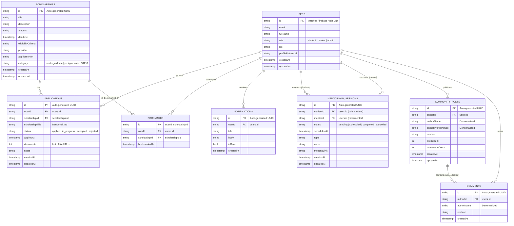

# Entity Relationship Diagram (ERD)

This document provides a logical representation of the database schema for the **EduBridge AI** platform. Although Firestore is a NoSQL document database, establishing clear relational structures helps ensure data consistency, clear access paths, and proper security rule boundary checks.

## Logical ERD Diagram

## Description of Relationships

1. **Users to Applications (1:N)**: A user can submit multiple scholarship applications. Each application belongs to exactly one user.
2. **Scholarships to Applications (1:N)**: A scholarship can have multiple student applications. Each application maps to one specific scholarship.
3. **Users to Bookmarks (1:N)**: A user can bookmark multiple scholarships. To prevent duplicates, the document ID is formulated as `${userId}_${scholarshipId}`.
4. **Users to Notifications (1:N)**: A user can receive multiple push or system notifications. Each notification is linked to a single user.
5. **Users to Mentorship Sessions (1:N / 1:M)**: A session links two users: one student and one mentor. Thus, there are two distinct relationships pointing from `USERS` to `MENTORSHIP_SESSIONS` (one as the student requestor, one as the mentor host).
6. **Users to Community Posts (1:N)**: A user can author multiple forum posts.
7. **Community Posts to Comments (1:N)**: Each post can have multiple comments. Comments are organized as a sub-collection nested directly under `community_posts/{postId}/comments` to localize reading and deletion patterns.
